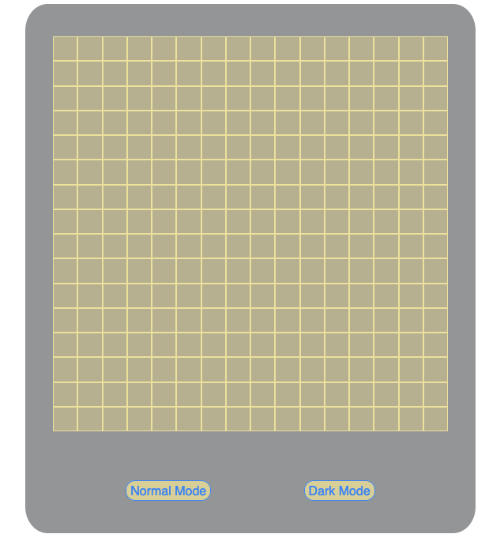
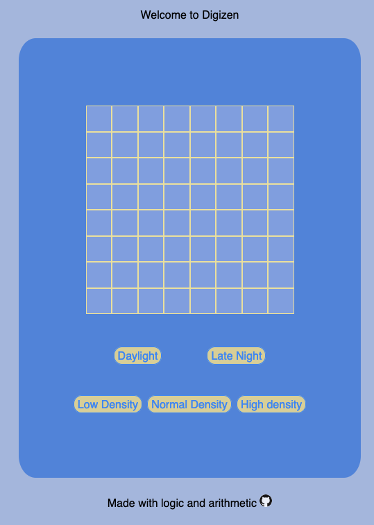
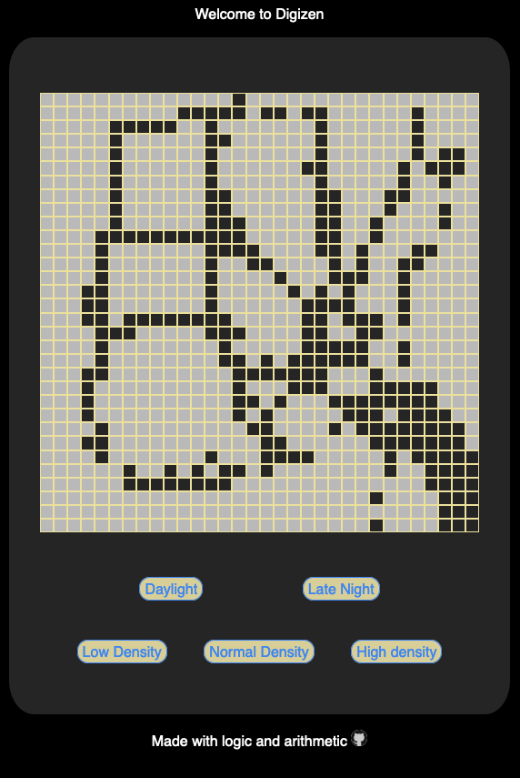

# Big Welcome
Welcome to digizen, a place that records a 2 dimensional record of where you hovered your mouse.  

## Languages
- HTML5
- CSS3
- Vanilla JS

## See it live
[Digizen!](https://mcjbyday.github.io/digizen/)

## Screenshots
| Image | Description |
| --- | ----------- |
|  | In progress (Daylight) |
|  | Latest (Default) |
|  | Latest (Late Night) |

## Why?
We all can benefit from a bit of recorded mouse hovering from time to time. 

## References / inspiration

### Odin project
Visit [The Odin Project](https://www.theodinproject.com/) to learn about a community that is helping developers understand programming concepts at no cost to them.

### Color-hex
[Color Palettes Color Schemes](https://www.color-hex.com/color-palettes/)

### Coding Bliss
https://www.youtube.com/watch?v=wtBt9oGAxBc

### Rise to code
https://www.youtube.com/watch?v=ACP61O9f618

## Other

No external installations are required to view this website. 

## Contact
Comments or questions?  
Author: Michael Jacobs  
Email: jacobsmichaelc@gmail.com  
GitHub: [https://github.com/mcjbyday](https://github.com/mcjbyday)  